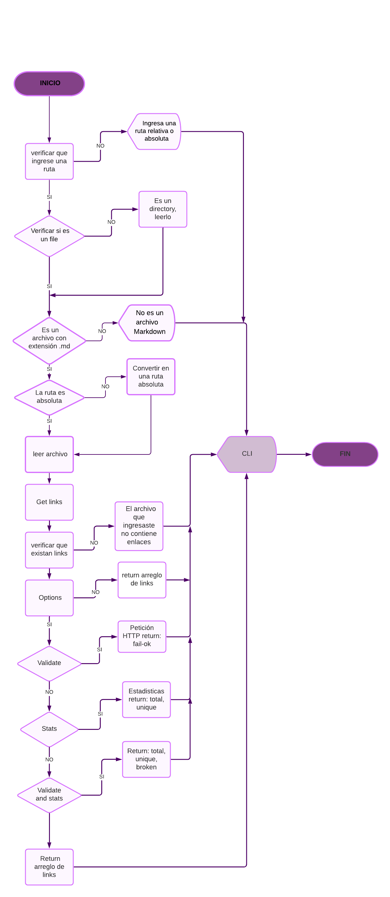

#  MARKDOWN LINKS 
Esta libreria  se desarrollo con el fin de leer y analizar archivos de formato **Markdown ('.md')** tomando en cuenta la ruta ingresada, la ruta a ejecutar. Esta herramienta permite verificar los links que se encuentran dentro de los archivos y reportar estadísticas acerca del total de los links, la cantidad de links rotos y únicos. Esta libreria se implementó usando JavaScript y Node.js.
 

##  INSTALACION Y GUIA DE USO

Para instalar esta libreria debe hacer lo siguiente en la linea de comando 

### INSTALACION

`$ npm install @danirami/bog001-md-links@1.2.0`


### USO

La aplicación se ejecuta de la siguiente manera a través de la linea de comando:


 ` $ md_checkLinks <path-to-file> [options]`


_Donde:_

path-to-file: Es la ruta absoluta o relativa al archivo o directorio que se desea analizar.
Options: son las siguientes opciones para ejecutar en la linea de comando: --validate, --stats,--stats y --validate juntos.

Si ejecutamos el comando  con una ruta sin ninguna option nos devuelve un arreglo de los links que contenga el archivo Markdown.

 
#### Ejemplo

```js
md_checkLinks <path-to-file>


[
 {
    href: 'https://scotch.io/tutorials/javascript-promises-for-dummies#toc-consuming-promises',
    text: 'Consumo de Promesas.',
    file: 'C:\\Users\\danie\\Documents\\MDL\\bog001-md-links\\src\\archivo.md'
  },
  {
    href: 'https://www.freecodecamp.org/news/how-to-write-a-javascript-promise-4ed8d44292b8/',
    text: 'Creación de Promesas.',
    file: 'C:\\Users\\danie\\Documents\\MDL\\bog001-md-links\\src\\archivo.md'
  },
  {
    href: 'https://nodejs.org/hi',
    text: 'https://nodejs.org/hi',
    file: 'C:\\Users\\danie\\Documents\\MDL\\bog001-md-links\\src\\archivo.md'
  }
]
```

### Options


_--validate_

Si pasamos la opción --validate, el módulo hace una petición HTTP para averiguar si el link funciona o no. Si el link resulta en una redirección a una URL que responde ok, entonces considera el link como ok o de lo contrario fail.


#### Ejemplo

```js
md_checkLinks <path-to-file> --validate

 
{
  href: 'https://nodejs.org/hi',
  text: 'https://nodejs.org/hi',
  file: 'C:\\Users\\danie\\Documents\\MDL\\bog001-md-links\\src\\archivo.md',
  status: 404,
  status_message: 'fail'
}
{
  href: 'https://developer.mozilla.org/en-US/docs/Web/JavaScript/Reference/Statements/export/',
  text: '<code>export</code>',
  file: 'C:\\Users\\danie\\Documents\\MDL\\bog001-md-links\\src\\archivo.md',
  status: 200,
  status_message: 'ok'
}
{
  href: 'https://scotch.io/tutorials/javascript-promises-for-dummies#toc-consuming-promises',
  text: 'Consumo de Promesas.',
  file: 'C:\\Users\\danie\\Documents\\MDL\\bog001-md-links\\src\\archivo.md',
  status: 200,
  status_message: 'ok'
}
```

 _--stats_

Si pasamos la option --stats nos devuelve un texto con estadísticas básicas sobre los links, cantidad de links en el archivo y sus links únicos.


#### Ejemplo

```sh
 $ md_checkLinks <path-to-file> --stats

 Total: 3
Unique: 3 
```


_--stats --validate_

Si pasamos estas dos options combinadas obtenemos  estadísticas que necesiten de los resultados de la validación, cantidad de links en el archivo, sus links únicos y rotos.


#### Ejemplo

```sh
md_checkLinks <path-to-file> --stats --validate
Total: 3
Unique: 3
Broken: 1
```


## IMPORTANDO EL  MODULO  CON  REQUIRE  PARA USARLO


`const mdlinks = require('@danirami/bog001-md-links')`

_Cualquiera de las dos opciones te retornar un arreglo de objetos de links:_

 ``[{ href, text, file }]``


`mdLinks('test').then(data => console.log(data))`


`mdLinks('test', { validate: false }).then(data => console.log(data))`


_Para validar el status de los links  :_

`mdLinks('test', { validate: true }).then(data => console.log(data))`

`[{ href, text, file, status, status_message }]`


### FLUJO 


 


## Autor: Daniela Ramirez  Aristizabal.